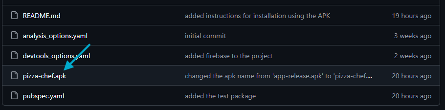
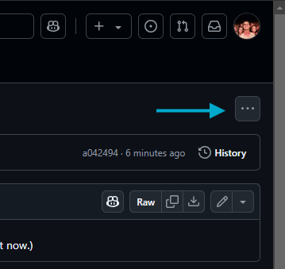
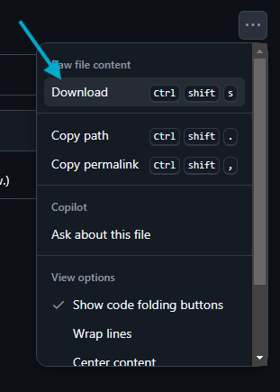
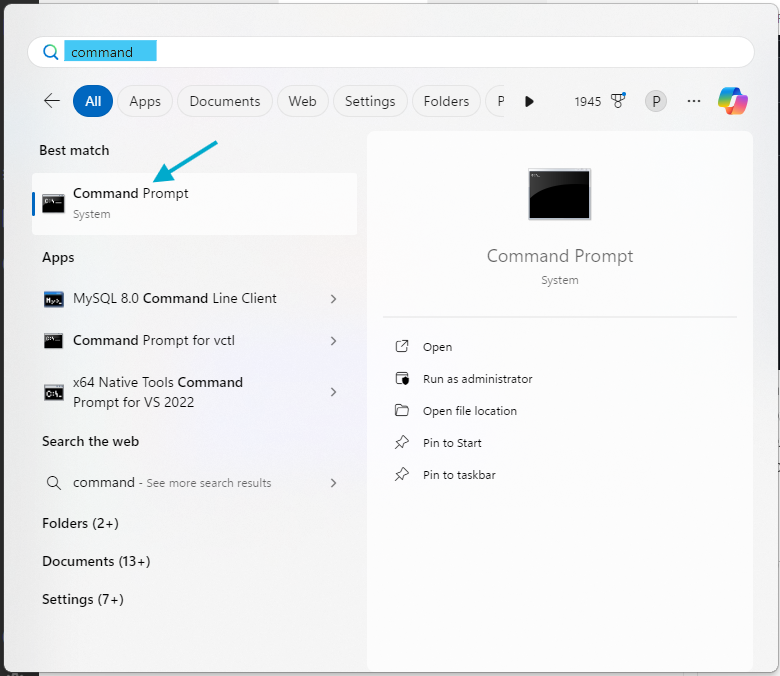
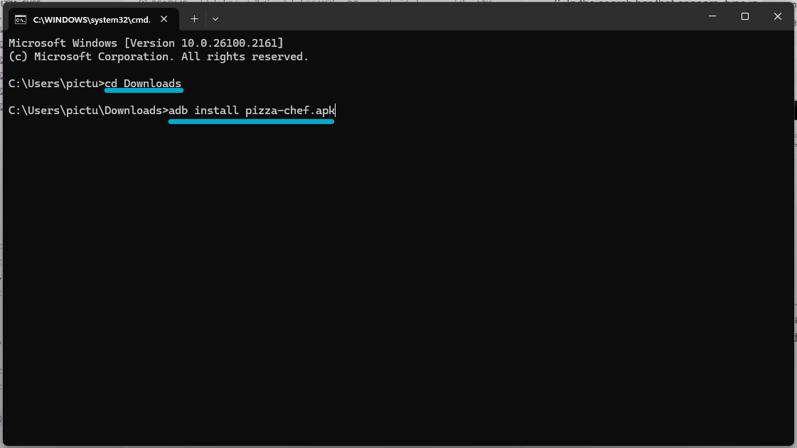
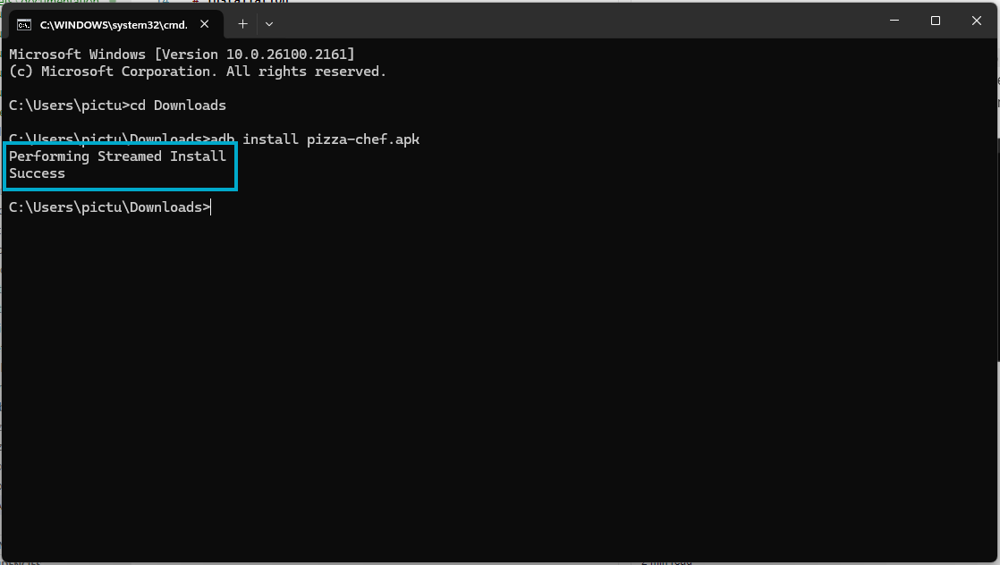
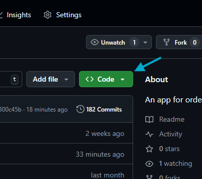
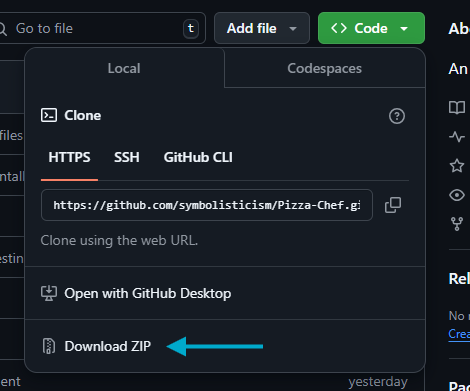
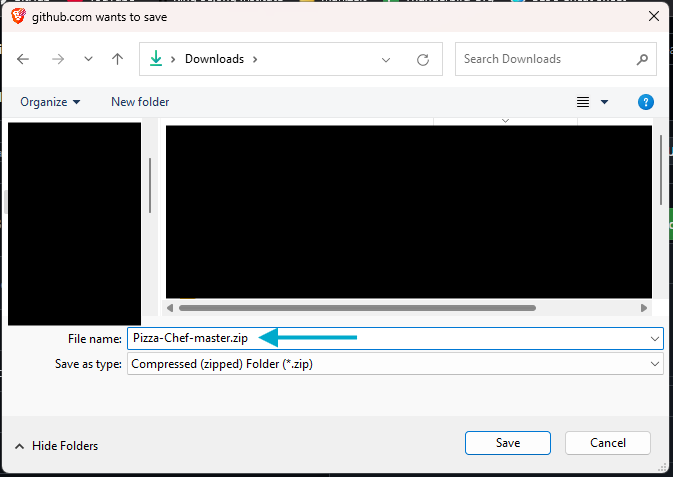

# Pizza Chef
This is a pizza ordering application. You can create pizzas, view them in your cart, update them in your cart, and delete them if you want to start from scratch.

  
  
  
  
  
  
  
  
  
  
  

# Accessing the Pizza Chef app

## 1. Install on a mobile phone (Android)

### Prerequisites
This app is only available on Android. To download the app to your Android device, ensure that you have your device, a Windows PC, and a cable connecting your device to your Windows PC. Plug the cable into your device, and plug the other end of the cable into your PC before beginning.

If you are downloading the app onto a mobile device, the simplest way to do this is to use the `app-release.apk` file in the repository.

### Instructions

1. Locate the file named `pizza-chef.apk` in the repository above and click on it.

2. On the page it brings you to, there is a menu button with three dots near the top right corner. Click on that.

3. On the menu that appears underneath it, click on the button that says "Download".

4. The file will be downloaded to the location you choose in your system. *Make note of where it gets downloaded because you'll need the file path for the next step. I downloaded it to my `Downloads` directory under my user.*
5. Press the Windows key or click on start on your PC
6. In the search bar that appears, type in `command`, and click on the app named "Command Prompt" that appears underneath.

7. When the command prompt window opens, navigate to the directory in which your downloaded APK resides. For me, I am changing to the `Downloads` directory. 
8. Once in the right directory, run the command `adb install pizza-chef.apk`, where "pizza-chef.apk" should be the name of the file you downloaded. If it is not, type in the name of the APK as it is in your file system.

9. If you've done all that correctly, you will see a message stating that the streamed install is in progress, followed by a success message. You are now ready to open and interact with the app on your Android phone.

## 2. On the web
To access the web version of the Pizza Chef app, open [this link](https://pizza-chef-873cf.web.app).

# Running Tests Locally
*Note: All instructions for running tests are written with the assumption that the user is using a Windows computer running Windows 11.*

1. To run the automated test script locally, download the GitHub repository to your computer. You can do this by clicking the 'Code' button near the top right of the screen.

2. Then, click 'Download Zip' from the menu that appears.

If prompted, choose a place to save the zip folder and a name for it. I have chosen to save mine to my Downloads folder and leave the default name. 
*Note: If you are not prompted to choose a place where it should be downloaded, check your Downloads folder.*

3. Next, open your File Explorer and locate your newly downloaded zip folder. Click on it once, then right click on it and select 'Extract All' from the menu that appears.

The file structure of the extracted folder will be:  `Project Name > Project Name > Project Files`. 
You need to navigate down to the second `Project Name` level, but still one directory above the `Project Files`. You can navigate one directory deeper by double clicking on a folder. If you've navigated to the correct directory, you will see the name of the project in the search bar above and only one folder in your current directory with the same name as above.

4. When you're in the right directory, click on the folder once, then right click it. In the menu that appears, click 'Copy as Path'.

5. Next, open your terminal application by pressing and holding the Windows key and then pressing the 'R' key.
In the dialog box that appears, ensure that 'cmd' is entered into the text box labeled 'Open', and then click 'OK'.

6. Your terminal application will open. Using that path you copied from step 4, enter `cd <copied path>` and then press 'Enter'. Then type `flutter test` and press 'Enter'

7. You will see the project download all the necessary dependencies needed for the app, and then you will see the tests run. Once the tests have completed, you will see a message that reads, "All tests passed!"

